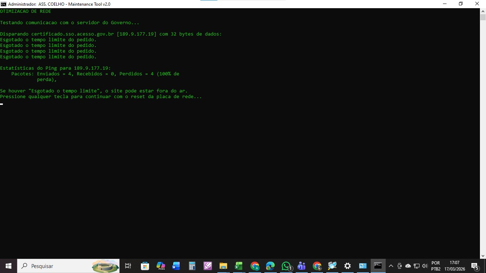
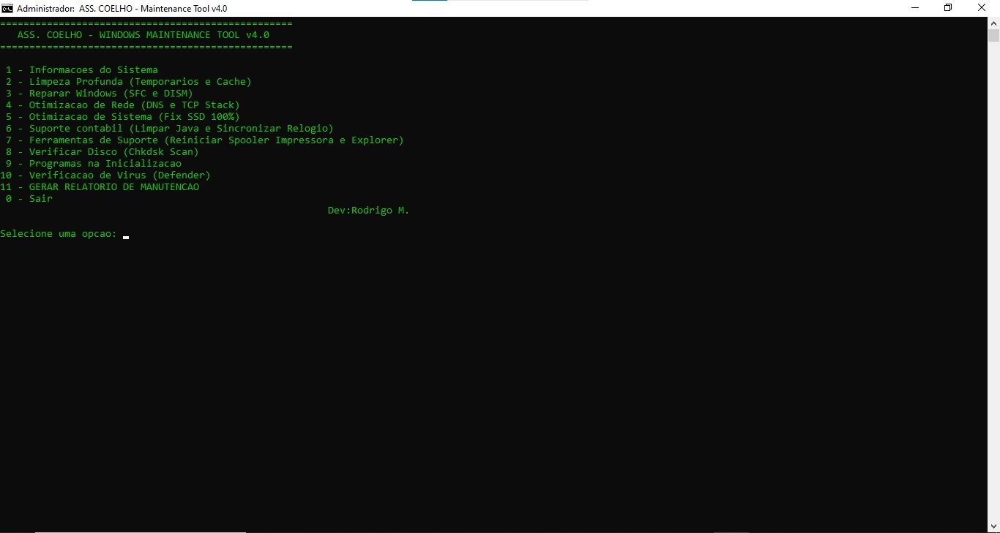
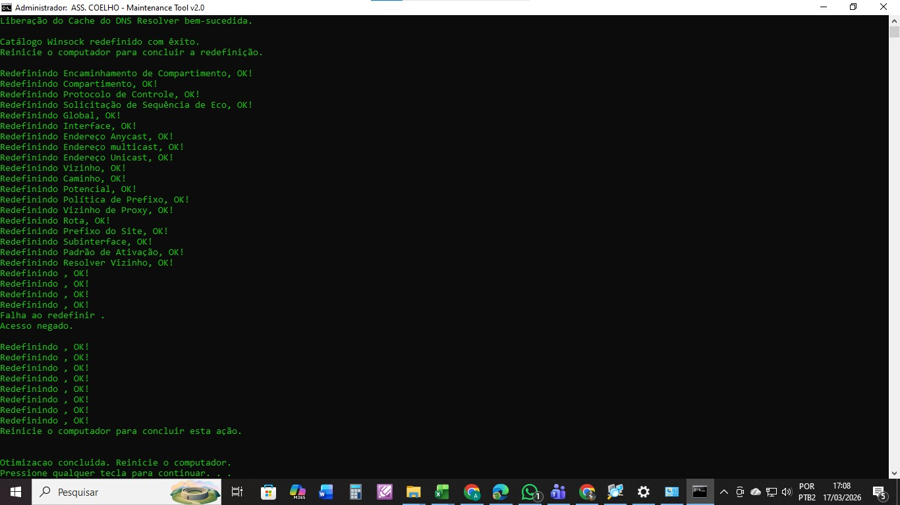

  
  

# ASS. COELHO - Windows Maintenance Tool v4.0

Ferramenta de manutenção e suporte técnico para ambientes
Windows corporativos, desenvolvida e implantada na
Assessoria Coelho.

---

## Problema resolvido

Manutenções preventivas e corretivas eram feitas
manualmente, comando por comando, sem padronização entre
máquinas e sem registro das ações executadas. O processo
era demorado, sujeito a erro humano e sem rastreabilidade.

---

## Demonstração do Sistema

### Sistema em execução na rede local

Execução do sistema em ambiente de rede local, demonstrando
comunicação entre máquinas e funcionamento estável após
configuração da infraestrutura.

### Interface principal do sistema

Tela inicial com os principais módulos do sistema.
Interface estruturada para navegação simples e execução
eficiente das rotinas automatizadas.

### Problema identificado

Cenário inicial com falhas na rede e indisponibilidade
do sistema, impactando diretamente o fluxo operacional.

### Processo de otimização

Etapa de análise e implementação de melhorias, incluindo
ajustes de configuração e correção de gargalos na rede.

### Resultado após otimização

Situação final após aplicação das melhorias, demonstrando
maior estabilidade e ganho de desempenho operacional.

---

## Módulos disponíveis

| # | Módulo | O que faz |
|---|--------|-----------|
| 1 | Informações do Sistema | CPU, RAM, disco e versão do SO |
| 2 | Limpeza Profunda | Temporários, cache, prefetch, DNS |
| 3 | Reparar Windows | SFC /scannow + DISM RestoreHealth |
| 4 | Otimização de Rede | Winsock reset, TCP stack, DNS flush |
| 5 | Otimização de Sistema | Desativa SysMain/WSearch (fix SSD 100%) |
| 6 | Suporte Contábil | Cache Java + sincroniza relógio para certificados digitais |
| 7 | Ferramentas de Suporte | Reset Spooler de impressão + reinicia Explorer |
| 8 | Verificar Disco | Chkdsk scan |
| 9 | Programas na Inicialização | Lista programas do startup |
| 10 | Verificação de Vírus | Windows Defender scan via linha de comando |
| 11 | Gerar Relatório | Exporta .txt completo para a área de trabalho |

---

## Destaques técnicos

- Verificação automática de privilégios de Administrador
- Menu interativo com navegação por input numérico
- Supressão de erros com `>nul 2>&1` para execução limpa
- Relatório gerado automaticamente com data, hora,
  nome do computador e usuário
- Módulo de Suporte Contábil específico para escritório
  contábil: resolve falhas de certificado digital causadas
  por relógio desincronizado

---

## Impacto da solução

- Redução de indisponibilidade da rede
- Automação de processos manuais de manutenção
- Melhoria na eficiência operacional
- Maior confiabilidade no ambiente corporativo
- Rastreabilidade com relatório por máquina

---

## Tecnologias utilizadas

- Batch Script (.bat) — automação e manutenção
- Comandos nativos Windows: `sfc`, `DISM`, `netsh`,
  `chkdsk`, `wmic`, `sc`, `w32tm`, `taskkill`
- Windows Defender CLI (`MpCmdRun.exe`)
- Redes (configuração e diagnóstico)

---

## Como usar

1. Clique com botão direito no arquivo `.bat`
2. Selecione **"Executar como administrador"**
3. Escolha o módulo desejado no menu
4. Para relatório completo: opção **11**

> A ferramenta verifica automaticamente se foi executada
> como administrador. Sem privilégios, exibe aviso e encerra.

---

## Autor

Desenvolvido por Rodrigo Mateus Silva  
[linkedin.com/in/rodrigo-mateus-ti](https://linkedin.com/in/rodrigo-mateus-ti)
