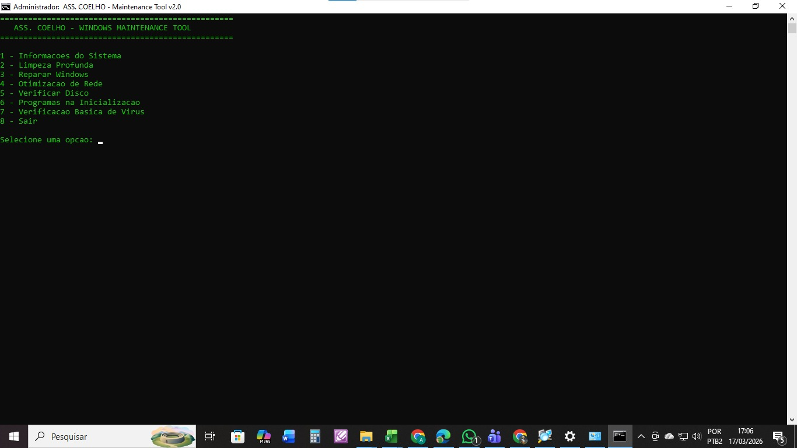

## 📸 Demonstração do Sistema

---

### 🖥️ Sistema em execução na rede local

Execução do sistema em ambiente de rede local, demonstrando comunicação entre máquinas e funcionamento estável após configuração da infraestrutura. Evidencia disponibilidade e acesso simultâneo.

---

### 📋 Interface principal do sistema

Tela inicial com as principais funcionalidades do sistema. Interface estruturada para navegação simples e execução eficiente das rotinas automatizadas.

---

### ⚠️ Problema identificado

Cenário inicial com falhas na rede e indisponibilidade do sistema, impactando diretamente o fluxo operacional e a produtividade.

---

### ⚙️ Processo de otimização

Etapa de análise e implementação de melhorias, incluindo ajustes de configuração, scripts de automação e correção de gargalos na rede.

---

### 🛠️ Resultado após otimização

Situação final após aplicação das melhorias, demonstrando maior estabilidade, redução de falhas e ganho de desempenho operacional.

---

## 🚀 Impacto da Solução

- Redução de indisponibilidade da rede  
- Automação de processos manuais  
- Melhoria na eficiência operacional  
- Maior confiabilidade no ambiente  

---

## 🧪 Tecnologias utilizadas

- Python (automação)
- Scripts `.bat`
- Redes (configuração e diagnóstico)
- Google Apps Script (se aplicável)
